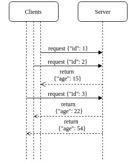
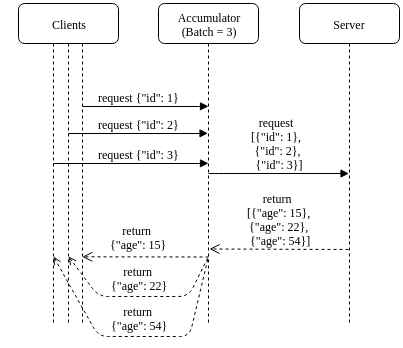

# http_accumulator
Acts as a proxy that accumulates many small http requests into bigger requests

## Example

Supose you have a microservice server that serves user age from their ids:

You can deploy accumulator in between so that the server recieves a smaller of number of **batch** requests

This can improve performance in some cases.

In those cases the Accumulator is a helpful way of having the batch control at the server side
instead of leaving it to the clients.

## testing it

`docker-compose up` will raise the test stack which consists of:
* accumulator at port 9992
* doubler server at port 9991 (a simple server that doubles numbers for you)

Send requests to our demo 'doubler' server at `curl localhost:9991 --data 12 --data 10` to see it in action.

Now, use the accumulator to consolidate singular requests into larger batches

    for i in `seq 10`; do curl localhost:9992 --data $i > /tmp/testing_$i & done
    cat /tmp/testing_*

The accumulator will wait and hold connections until there are N accumulated requests
or T time has passed since the first request and finally send everything
to the underlying server. It will then de-multiplex responses and send the correct one to each client
